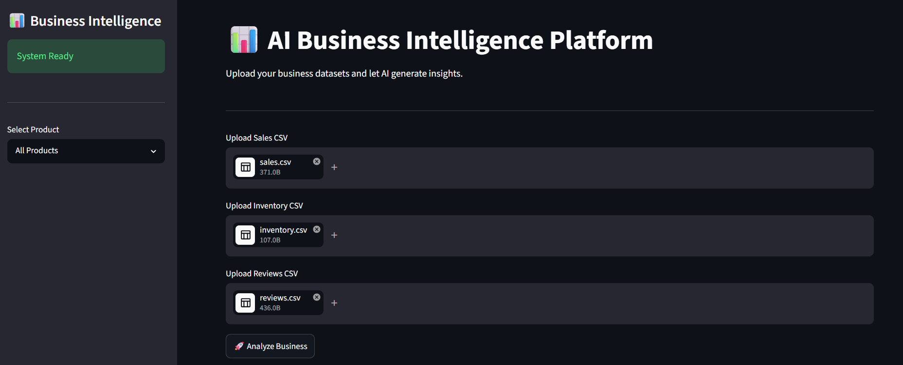
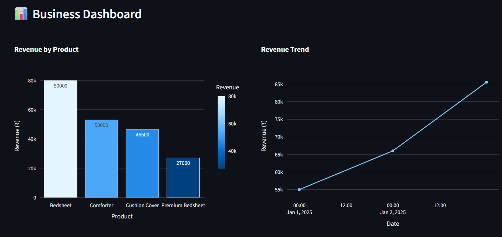
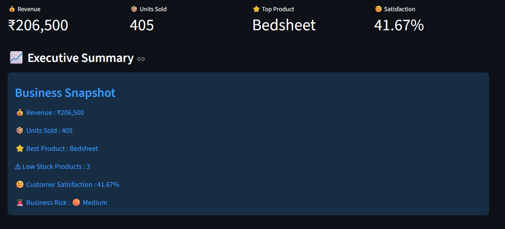
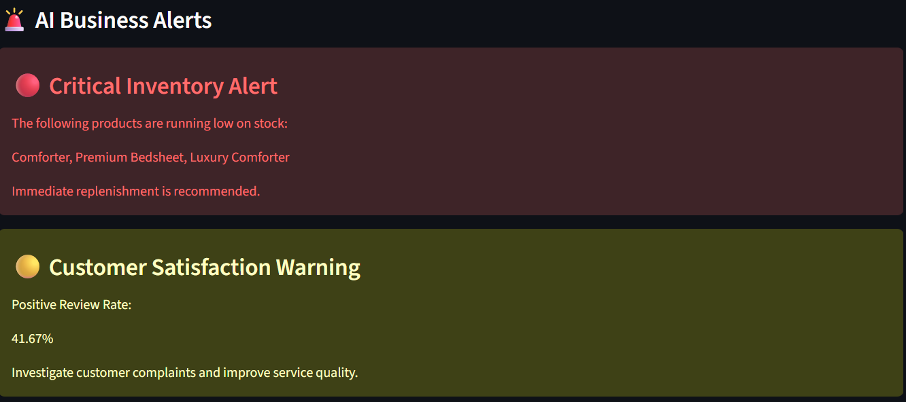
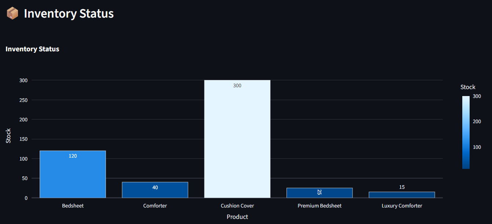
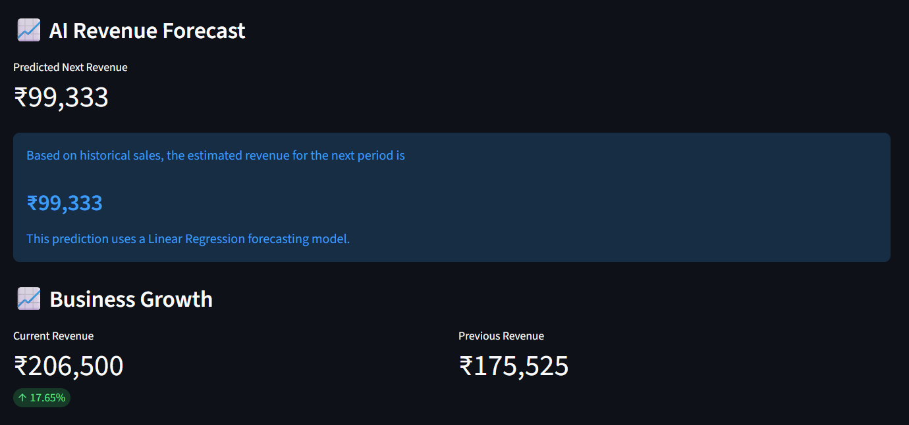
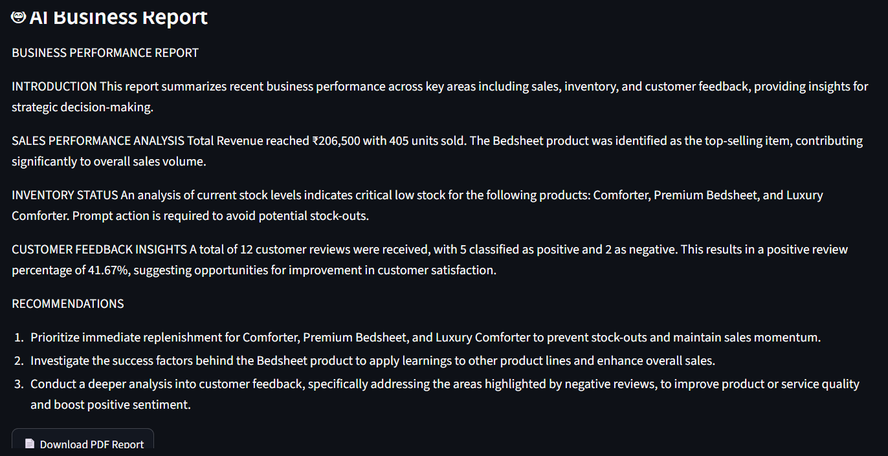
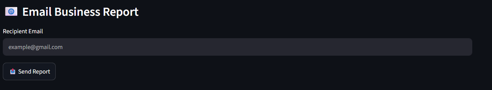
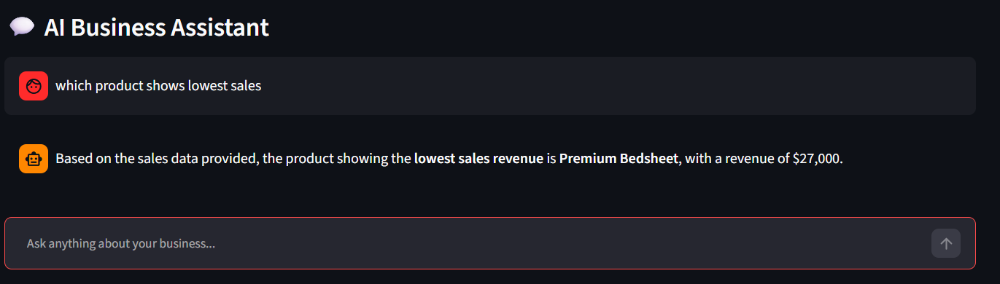

# 📊 AI Business Intelligence Platform

An AI-powered Business Intelligence Dashboard that analyzes Sales, Inventory, and Customer Reviews to generate professional business insights using Google Gemini AI.

---

## 🚀 Features

- 📈 Sales Analysis
- 📦 Inventory Analysis
- ⭐ Customer Review Sentiment Analysis
- 🤖 AI-Generated Business Reports
- 💬 AI Business Chat Assistant
- 📊 Interactive Plotly Dashboards
- 📄 PDF Report Download
- 📧 Email Report to Any Email Address
- 📉 Sales Forecasting
- 🔄 Product Comparison
- 🚨 Business Alerts
- 📋 Executive Summary

---

## 🛠️ Tech Stack

- Python
- Streamlit
- Google Gemini API
- Pandas
- Plotly
- ReportLab

---

## 📂 Project Structure

```
business-intelligence-ai/
│
├── agents/
├── components/
├── services/
├── utils/
├── app.py
├── requirements.txt
├── README.md
└── .gitignore
```

---

## ⚙️ Installation

Clone the repository:

```bash
git clone https://github.com/Vanshika218/business-intelligence-ai.git
```

Go inside the project:

```bash
cd business-intelligence-ai
```

Install dependencies:

```bash
pip install -r requirements.txt
```

Run the project:

```bash
streamlit run app.py
```

---

## 📊 How It Works

1. Upload Sales CSV
2. Upload Inventory CSV
3. Upload Reviews CSV
4. Click **Analyze Business**
5. View KPIs and dashboards
6. Download the AI-generated PDF report
7. Email the report
8. Ask business-related questions using the AI chatbot

---

## 📷 Screenshots

# 📸 Application Screenshots

## 🏠 Home Page



---

## 📊 Business Dashboard



---

## 📋 Executive Summary



---

## 🚨 Business Alerts



---

## 📦 Inventory Status



---

## 📈 Revenue Forecast



---

## 🤖 AI Business Report



---

## 📧 Email Report



---

## 💬 AI Assistant



---

## 👩‍💻 Author

**Vanshika Agarwal**

AI Business Intelligence Platform using Python, Streamlit, Plotly, and Google Gemini AI.